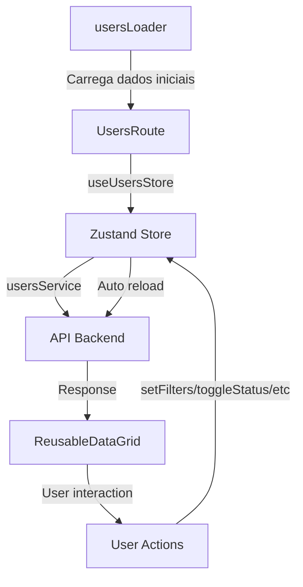

# Rota de Usuários - AutoPass Frontend

## 📋 Resumo da Implementação

Este documento descreve a implementação completa da **rota de listagem de usuários** no sistema AutoPass Frontend, seguindo o padrão arquitetural estabelecido no projeto.

## 🚀 Funcionalidades Implementadas

### ✅ Listagem de Usuários
- **DataGrid do Material UI v8.9.1** com paginação server-side
- **Filtros e ordenação** do lado do servidor
- **Busca em tempo real** por login, email ou nome
- **Campos relevantes** exibidos: Login, Email, Nome, Perfil, Organização, Status, Data de Criação

### ✅ Controles de Ação
- **Switch de ativação/desativação** de usuários (isActive)
- **Botões de ação** com ícones:
  - ✏️ **Editar** - Botão azul com ícone de edição
  - 🗑️ **Excluir** - Botão vermelho com ícone de lixeira
  - ➕ **Adicionar Usuário** - Botão verde no cabeçalho

### ✅ Interface Responsiva
- **Barra de busca** dedicada com ícone e botão de atualizar
- **Chips coloridos** para perfis (ADMIN/OPERATOR)
- **Tooltips informativos** em botões de ação
- **Mensagens de status** para feedback do usuário

## 🏗️ Arquitetura Implementada

### 📁 Estrutura de Arquivos
```
src/routes/users/
├── index.ts              # Barrel exports
├── UsersRoute.tsx        # Componente principal da rota
├── store.ts              # Estado Zustand com integração API
├── schema.ts             # Validação Zod + TypeScript types
├── loader.ts             # React Router loader
```

### 🔧 Serviços e APIs
```
src/shared/services/
├── users.ts              # Serviço de usuários com todos os endpoints
├── api.ts                # Cliente HTTP (adicionado método PATCH)
├── index.ts              # Exports centralizados
```

### 🎨 Componentes Reutilizáveis
```
src/shared/ui/
├── ReusableDataGrid.tsx  # DataGrid dinâmico e configurável
├── CustomButton.tsx      # Botão personalizado AutoPass
```

## 🔗 Integração com Roteamento

### App.tsx
```typescript
// Rota adicionada ao router principal
{
  path: '/users',
  element: <Layout />,
  loader: protectedLoader,
  children: [
    {
      index: true,
      element: <UsersRoute />,
      loader: usersLoader,
    },
  ],
}
```

### Layout.tsx
```typescript
// Menu de navegação atualizado
const menuItems = [
  { text: 'Dashboard', path: '/dashboard', icon: <DashboardIcon /> },
  { text: 'Dispositivos', path: '/devices', icon: <DevicesIcon /> },
  { text: 'Usuários', path: '/users', icon: <PeopleIcon /> }, // ✅ NOVO
];
```

## 📊 API Integration

### Endpoints Implementados
```typescript
// Serviço de usuários (src/shared/services/users.ts)
class UsersService {
  getUsers(filters)         // GET /users?page=1&limit=10&search=...
  getUserById(id)           // GET /users/:id
  createUser(userData)      // POST /users
  updateUser(id, userData)  // PUT /users/:id
  deleteUser(id)            // DELETE /users/:id
  toggleUserStatus(id)      // PATCH /users/:id/toggle-status
  resetPassword(email)      // POST /users/reset-password
  changePassword(data)      // POST /users/change-password
}
```

### Filtros Server-Side
```typescript
interface UserFilters {
  search?: string;           // Busca por login, email ou nome
  page?: number;             // Paginação
  limit?: number;            // Itens por página
  sortBy?: string;           // Campo de ordenação
  sortOrder?: 'asc'|'desc';  // Direção da ordenação
  userRole?: 'ADMIN'|'OPERATOR'; // Filtro por perfil
  isActive?: boolean;        // Filtro por status
  tenantId?: string;         // Filtro por organização
}
```

## 🎯 Estado Gerenciado com Zustand

### Store Features
- ✅ **Estado local isolado** por implementação
- ✅ **Integração com API** real (substituindo mocks)
- ✅ **Loading states** para UX
- ✅ **Error handling** robusto
- ✅ **Reatividade** com filtros e paginação

### Principais Actions
```typescript
// Store principal (src/routes/users/store.ts)
{
  loadUsers(filters),       // Carrega dados da API
  toggleUserStatus(id),     // Alterna ativo/inativo
  removeUser(id),           // Exclui usuário
  setFilters(filters),      // Atualiza filtros + reload
  setPage(page),            // Paginação
  setLimit(limit),          // Itens por página
}
```

## 🔍 Componente ReusableDataGrid

### Características
- ✅ **Dinâmico e configurável** - Columns definidas por implementação
- ✅ **Server-side filtering** - Filtros processados no backend
- ✅ **Server-side pagination** - Paginação otimizada
- ✅ **Server-side sorting** - Ordenação no servidor
- ✅ **Material UI v8.9.1** - Versão mais recente
- ✅ **Tradução PT-BR** completa
- ✅ **Toolbar customizada** com exportação

### Props Principais
```typescript
interface ReusableDataGridProps {
  rows: T[];                    // Dados da tabela
  columns: DataGridColumn[];    // Definição das colunas
  totalRows: number;            // Total para paginação
  loading?: boolean;            // Estado de carregamento
  pagination?: PaginationModel; // Configuração de páginas
  onPaginationChange?;          // Callback paginação
  onSortChange?;               // Callback ordenação
  onFilterChange?;             // Callback filtros
  // ... outras props de customização
}
```

## 🎨 UI/UX Features

### Busca Avançada
- **Campo de busca dedicado** com ícone
- **Busca por Enter** ou botão
- **Botão de refresh** para recarregar dados
- **Feedback visual** durante busca

### Tabela de Dados
- **Colunas responsivas** com larguras otimizadas
- **Hover effects** em linhas
- **Switch animado** para status
- **Chips coloridos** para perfis
- **Tooltips informativos**

### Ações de Usuário
- **Confirmação de exclusão** com dialog nativo
- **Feedback de erro/sucesso**
- **Estados de loading** individuais

## 🔒 Validação e Tipos

### Schemas Zod
```typescript
// Validação robusta com Zod (src/routes/users/schema.ts)
UserSchema               // Usuário completo
CreateUserSchema         // Criação (sem id, dates)
UpdateUserSchema         // Atualização (campos opcionais)
UserFiltersSchema        // Filtros de busca
UsersResponseSchema      // Resposta da API
```

### TypeScript Integration
- ✅ **Types exportados** de schemas Zod
- ✅ **Props tipadas** para componentes
- ✅ **API responses tipadas**
- ✅ **Error handling tipado**

## 🚀 Como Acessar

1. **Menu Principal**: Clique em "Usuários" no sidebar
2. **URL Direta**: `http://localhost:5173/users`
3. **Autenticação**: Protegida por `protectedLoader`

## 🔄 Fluxo de Dados



## 📝 Próximos Passos

### Sugestões de Melhorias
1. **Modal de edição** de usuários
2. **Modal de criação** de novos usuários
3. **Filtros avançados** (dropdown, date pickers)
4. **Exportação** de dados (CSV, Excel)
5. **Seleção múltipla** para ações em lote
6. **Histórico de ações** do usuário

### Extensibilidade
O padrão implementado pode ser facilmente replicado para outras entidades:
- `devices` (já implementado)
- `organizations/tenants`
- `access-logs`
- `reports`

---

## ✅ Conclusão

A implementação da **rota de usuários** está **completa e funcional**, seguindo todas as boas práticas do projeto:

- ✅ **Padrão arquitetural** consistente
- ✅ **Material UI DataGrid** v8.9.1
- ✅ **Server-side filtering** implementado
- ✅ **Componente reutilizável** para outras telas
- ✅ **Estado isolado** por implementação
- ✅ **Integração com API** real
- ✅ **TypeScript + Zod** para type safety
- ✅ **UI/UX responsiva** e intuitiva

A funcionalidade está pronta para uso em produção! 🎉
